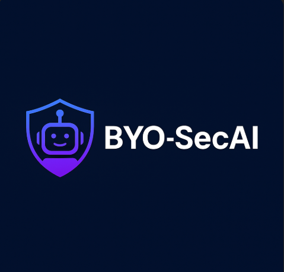

  
  
  
  
  

# Build Your Own AI Assistant for Security Research (BYO-SecAI)

  

A local-first assistant powered by Ollama + OpenWebUI and custom automation for threat hunting, detection, and IR.
Inspired by <a href="https://www.cactuscon.com/cc13-schedule#">CactusCon 13 Presentation<a/> [DIY AI: Build Your Own Digital InfoSec Team with BYOLLM] (https://christiant.io/), adapted for cybersecurity operations by Paladin316 with help from Aegis (My AI Assistant). 

Customized for Cybersecurity Research: Threat Hunting, Detection Engineering, and Incident Response. 

## Overview
This guide helps you set up your own local AI assistant for cybersecurity ops using **Ollama + OpenWebUI**.

## Prerequisites
- Windows 11 or 10
- Python 3.10
- Docker Desktop
- Ollama + OpenWebUI

## Quick Setup Summary
1. Install Python 3.10 and Docker
2. Install Ollama and run `ollama run phi`
3. Clone and launch OpenWebUI with Docker
4. Connect WebUI to Ollama (`http://host.docker.internal:11434`)
5. Use the provided script to interact with your local AI

## Credits
- Christian Taillon - ['DIY AI: Build Your Own Digital InfoSec Team with BYOLLM'](https://christiant.io/)
- Ollama for LLM hosting
- OpenWebUI for the interface
- Retrieval-Augmented Generation (RAG)
- Aegis (My AI Assistant) for development assistance

See [`getting_started.md`](getting_started.md) to begin.
